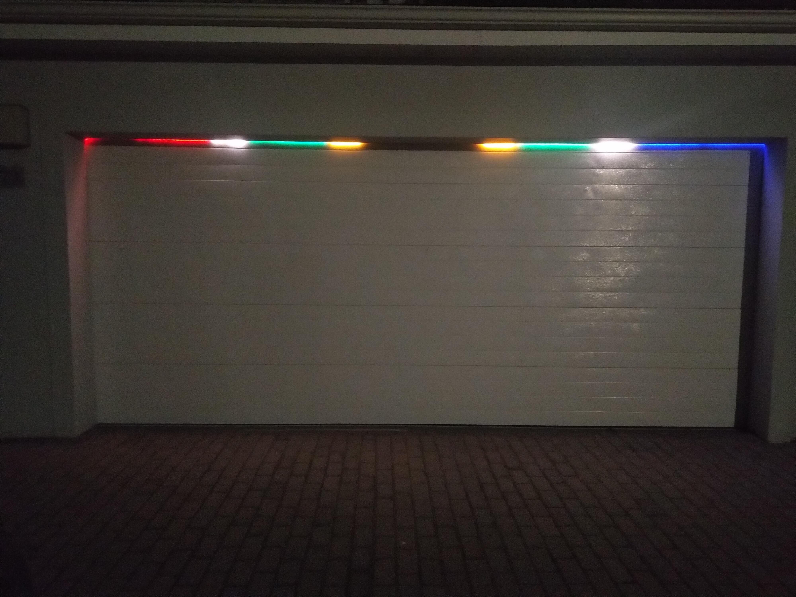
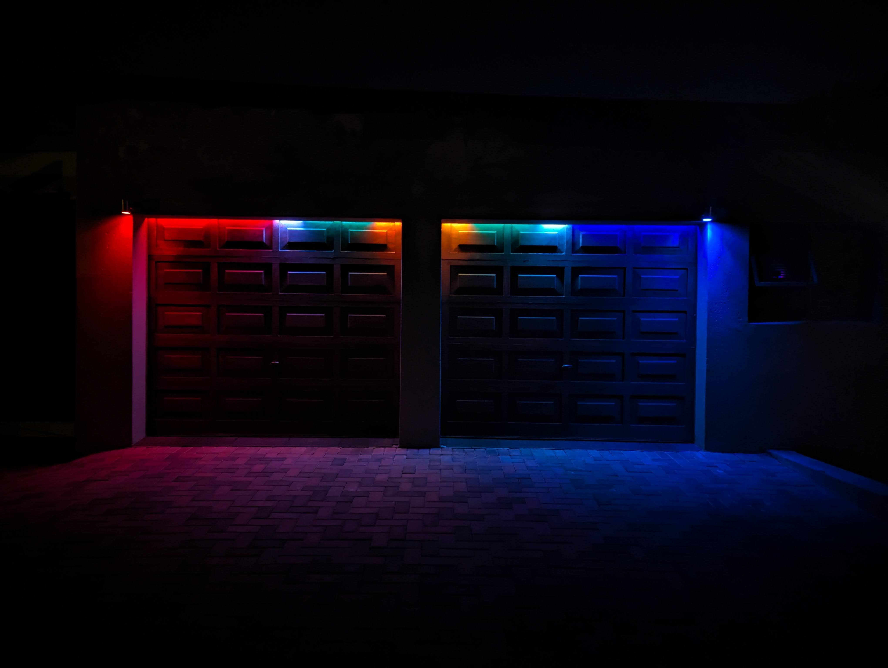

# Garage Door Lights

## Requirements
- Addressable LED stip with a WLED controller integrated with Home Assistant.
- A way to detect your door's open, closed and moving (opening/closing) states.  This can be done using two door sensors.  I use an [ESP Home Garage Door Controller](https://github.com/wernerhp/esphome/tree/main/garage-door) with two door sensors. 

## WLED
Configure the desired [presets](wled-presets.json) on your device.

## Automation
The garage door controller detects the closed, moving and opening states.  This can be done using two door switches and a template sensor.  e.g.
```yaml



  open

  moving

  closed

  unknown

```

The [automation](automation.yaml) uses the state form the door sensors to select one of the WLED presets.

## Demo





<video src="VID_20220324_191508.mp4" controls title="Garage Door Light Automation"></video>
